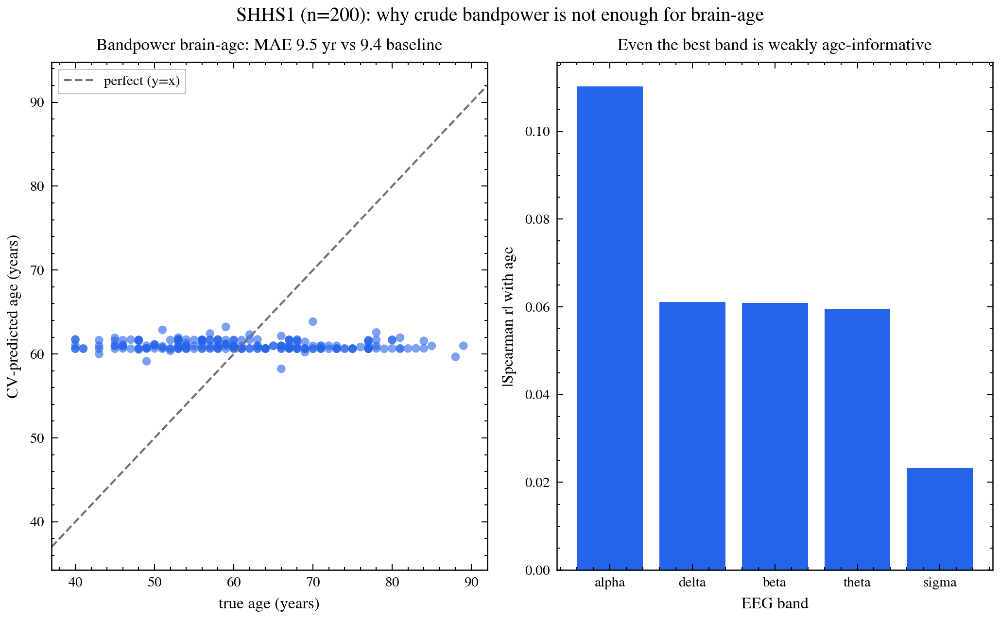

# eeg-physio-ml

Can you guess someone's age from their sleeping brain waves?

This repo is a small, honest test of that question. It takes overnight EEG
(brain-wave) recordings, pulls out simple features, and checks how well those
features predict a person's age. It also gives you a clean way to compare two
different kinds of EEG on the same test.

I built it after reading the Katabi Lab's work at MIT on turning breathing
signals into EEG and on learning better representations for regression
(Rank-N-Contrast). This is my own independent project, not affiliated with
the lab.

## What I found (on real data)

I ran it on **200 real overnight recordings** from the Sleep Heart Health
Study (SHHS, via NSRR).

| | error in years |
|---|---|
| Just guessing everyone is the average age | 9.45 |
| My model using brain-wave features | 9.53 |

**The model did no better than guessing the average.** Simple brain-wave
features (how much slow vs fast activity there is, averaged over the whole
night) carry almost no information about age. The strongest single feature
had a correlation with age of only 0.11.

That's not a failure, it's the point. Crude features aren't enough. This is the
baseline that smarter, learned features have to beat.

## Does Rank-N-Contrast help? (head-to-head)

I then tested the Katabi Lab's Rank-N-Contrast objective against plain L1,
using their `loss.py` unmodified. Same small neural net, same folds, same
epochs, 3 random seeds. The only thing that changes is the training objective.

| training objective | error in years (mean ± std over seeds) |
|---|---|
| Guess the average age | 9.45 |
| Plain L1 | 9.91 ± 0.20 |
| Rank-N-Contrast, then L1 head | 9.62 ± 0.11 |

Two takeaways:
- **RnC beats plain L1 on average (2 of 3 seeds, and by a wider margin than it
  loses), and is more stable** (half the spread). The objective helps, even on
  physiological data, but 3 seeds is a small sample and the effect is modest.
  It also depends on training long enough: at 30 epochs the two are tied
  (9.52 vs 9.48), the gap only opens by 200. RnC needs time to shape the
  representation before the linear head can use it.
- **Neither beats guessing the average.** With only 5 numbers per night as
  input, there isn't enough signal for any objective to work with. The fix is
  better inputs (per-epoch features, more channels, or raw EEG), not a better
  loss. That's the next experiment.

Reproduce: `python scripts/rnc_vs_l1.py --features feats.npz`



## Try it in 30 seconds (no data needed)

```bash
pip install -r requirements.txt
python scripts/selfcheck.py
```

This builds fake brain-wave data where I *know* the answer, then checks that
the code recovers it. If this passes, the pipeline works.

## Run it on real data

You need your own copy of SHHS from NSRR (free with a signed data-use
agreement). Nothing from the dataset is included here.

```bash
python scripts/cache_shhs_features.py --edf-dir <folder of .edf files> --harmonized <shhs-harmonized.csv> --out feats.npz
python scripts/shhs_brainage_report.py --features feats.npz
```

The first command reads the recordings once and saves small feature files.
The second one trains the model, prints the numbers, and makes the figure.

## What's in here

```
src/eeg_eval/                    the core: features, models, fake data
scripts/selfcheck.py             quick test on fake data
scripts/cache_shhs_features.py   real recordings -> saved features
scripts/shhs_brainage_report.py  features -> numbers + figure
scripts/rnc_vs_l1.py             Rank-N-Contrast vs L1 head-to-head
src/rnc/loss.py                  Kaiwen Zha's RnCLoss, copied unmodified
scripts/run_eval.py              run any saved dataset through the models
scripts/prep_sleepedf.py         loader for a second public dataset (not finished)
figures/                         the figure above
results/                         the numbers, as a small JSON file
```

## License

MIT
